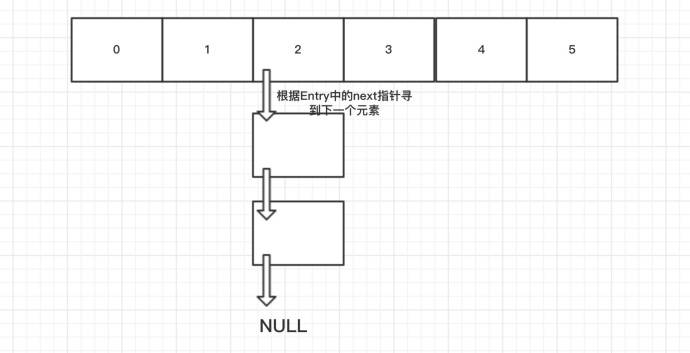
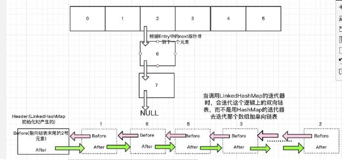

Least Recent Used

这个虽然是将经常使用的放在了队列的尾部（或前部），但lru对于get**并没有什么效率上的提升**，只是针对超出cache的部分，能够remove那些不经常使用的entry。

该实现只是利用LinkedHashMap去实现lru，**关键算法其实在LinkedHashMap中(包括linkedHashMap的数据结构)**，该LRU类只是重写了`LinkedHashMap#removeEldestEntry`方法，让LinkedHashMap实现remove超过cache的entry。

```java
private static final float hashLoadFactory = 0.75f;
private LinkedHashMap<K, V> mMap;
private int mCacheSize;

public LRU(int cacheSize) {
    this.mCacheSize = cacheSize;
    int capacity = (int) Math.ceil(cacheSize / hashLoadFactory) + 1;
    mMap = new LinkedHashMap<K, V>(capacity, hashLoadFactory, true) {
        private static final long serialVersionUID = 1;

        @Override
        protected boolean removeEldestEntry(Map.Entry eldest) {
            return size() > LRU.this.mCacheSize;
        }
    };
}
```

demo介绍：

1. 往lru中放入10个数
2. 打印所有的value
3. 使用get方法取出key5对应的值
4. 打印lru的size
5. 打印所有的value（**发现value5放在队尾**）
6. 往lru再放入5个数
7. 打印lru的size（发现是10，而不是15，因为前5个被lru缓存remove掉了）
8. 使用get方法取出key5对应的值
9. 打印所有的value（**发现value5放在队尾**）

```
value0 value1 value2 value3 value4 value5 value6 value7 value8 value9 
key = key5 value = value5
lruMap size = 10
value0 value1 value2 value3 value4 value6 value7 value8 value9 value5 
value6 value7 value8 value9 value5 value10 value11 value12 value13 value14 
lruMap size = 10
key = key5 value = value5
value6 value7 value8 value9 value10 value11 value12 value13 value14 value5 
```


---

https://juejin.im/post/5a4b433b6fb9a0451705916f

Hello,大家好，前面给大家讲了HashMap,LinkedList,知道了HashMap为数组+单向链表，LinkedList为双向链表实现的。今天给大家介绍一个(HashMap+"LinkedList")的集合，LinkedHashMap，其中HashMap用于存储数据，"LinkedList"用于存储数据顺序。OK，废话少说，老套路，文章结构:

1. LinkedHashMap和HashMap区别
2. LinkedHashMap底层实现
3. 利用LinkedHashMap实现LRU缓存

### 1. LinkedHashMap和HashMap区别

大多数情况下，只要不涉及线程安全问题，Map基本都可以使用HashMap，不过HashMap有一个问题，就是迭代HashMap的顺序并不是HashMap放置的顺序，也就是无序。HashMap的这一缺点往往会带来困扰，因为有些场景，我们期待一个有序的Map.这就是我们的LinkedHashMap,看个小Demo:

```
public static void main(String[] args) {
    Map<String, String> map = new LinkedHashMap<String, String>();
    map.put("apple", "苹果");
    map.put("watermelon", "西瓜");
    map.put("banana", "香蕉");
    map.put("peach", "桃子");

    Iterator iter = map.entrySet().iterator();
    while (iter.hasNext()) {
        Map.Entry entry = (Map.Entry) iter.next();
        System.out.println(entry.getKey() + "=" + entry.getValue());
    }
}

输出为：
apple=苹果
watermelon=西瓜
banana=香蕉
peach=桃子
```

**可以看到，在使用上，LinkedHashMap和HashMap的区别就是LinkedHashMap是有序的。** 上面这个例子是根据插入顺序排序，此外，LinkedHashMap还有一个参数决定**是否在此基础上再根据访问顺序(get,put)排序**,记住，是在插入顺序的基础上再排序，后面看了源码就知道为什么了。看下例子:

```
public static void main(String[] args) {
    Map<String, String> map = new LinkedHashMap<String, String>(16,0.75f,true);
    map.put("apple", "苹果");
    map.put("watermelon", "西瓜");
    map.put("banana", "香蕉");
    map.put("peach", "桃子");

    map.get("banana");
    map.get("apple");

    Iterator iter = map.entrySet().iterator();
    while (iter.hasNext()) {
        Map.Entry entry = (Map.Entry) iter.next();
        System.out.println(entry.getKey() + "=" + entry.getValue());
    }
}

输出为：
watermelon=西瓜
peach=桃子
banana=香蕉
apple=苹果
```

**可以看到香蕉和苹果在原来排序的基础上又排后了。**

### 2. LinkedHashMap底层实现

我先说结论，然后再慢慢跟代码。

- LinkedHashMap继承自HashMap,它的新增(put)和获取(get)方法都是复用父类的HashMap的代码，**只是自己重写了put给get内部的某些接口来搞事情**，这个特性在C++中叫**钩子技术**，在Java里面大家喜欢叫多态，其实多态这个词并不能很好的形容这种现象。

- LinkedHashMap的数据存储和HashMap的结构一样采用(数组+单向链表)的形式，只是在每次节点Entry中增加了用于维护顺序的before和after变量维护了一个双向链表来保存LinkedHashMap的存储顺序，当调用迭代器的时候不再使用HashMap的的迭代器，而是自己写迭代器来遍历这个双向链表即可。

- HashMap和LinkedHashMap内部逻辑图如下: 

  

  

好了，大家肯定会觉得很神奇，如图所示，本来HashMap的数据是0-7这样的无须的，而LinkedHashMap却把它变成了如图所示的1.6.5.3.。。2这样的有顺序了。到底是如何做到的了？其实说白了，就一句话，**钩子技术**，在put和get的时候维护好了这个双向链表，遍历的时候就有序了。好了，一步一步的跟。 先看一下LinkedHashMap中的Entry(也就是每个元素):

```
private static class Entry<K,V> extends HashMap.Entry<K,V> {
    // These fields comprise the doubly linked list used for iteration.
    Entry<K,V> before, after;

Entry(int hash, K key, V value, HashMap.Entry<K,V> next) {
        super(hash, key, value, next);
    }
    ...
}
```

可以看到继承自HashMap的Entry，并且多了两个指针before和after，这两个指针说白了，就是为了维护双向链表新加的两个指针。 列一下新Entry的所有成员变量吧:

- K key
- V value
- Entry<K, V> next
- int hash
- **Entry<K, V> before**
- **Entry<K, V> after**

其中前面四个，是从HashMap.Entry中继承过来的；后面两个，是是LinkedHashMap独有的。不要搞错了next和before、After，**next是用于维护HashMap指定table位置上连接的Entry的顺序的(next是用于维护每个table中的单链表)**，**before、after是用于维护Entry插入的先后顺序的(为了维护双向链表)**。

#### 2.1 初始化

```
 1 public LinkedHashMap() {
 2 super();
 3     accessOrder = false;
 4 }

1 public HashMap() {
2     this.loadFactor = DEFAULT_LOAD_FACTOR;
3     threshold = (int)(DEFAULT_INITIAL_CAPACITY * DEFAULT_LOAD_FACTOR);
4     table = new Entry[DEFAULT_INITIAL_CAPACITY];
5     init();
6 }

 1 void init() {
 2     header = new Entry<K,V>(-1, null, null, null);
 3     header.before = header.after = header;
 4 }

```

这里出现了第一个钩子技术,尽管init()方法定义在HashMap中，但是由于LinkedHashMap重写了init方法，所以根据多态的语法，会调用LinkedHashMap的init方法，该方法初始化了一个**Header**,**这个Header就是双向链表的链表头**..

#### 2.2 LinkedHashMap添加元素

HashMap中的put方法:

```
 1 public V put(K key, V value) {
 2     if (key == null)
 3         return putForNullKey(value);
 4     int hash = hash(key.hashCode());
 5     int i = indexFor(hash, table.length);
 6     for (Entry<K,V> e = table[i]; e != null; e = e.next) {
 7         Object k;
 8         if (e.hash == hash && ((k = e.key) == key || key.equals(k))) {
 9             V oldValue = e.value;
10             e.value = value;
11             e.recordAccess(this);
12             return oldValue;
13         }
14     }
15 
16     modCount++;
17     addEntry(hash, key, value, i);
18     return null;
19 }

```

LinkedHashMap中的addEntry(又是一个钩子技术):

```
 1 void addEntry(int hash, K key, V value, int bucketIndex) {
 2     createEntry(hash, key, value, bucketIndex);
 3 
 4     // Remove eldest entry if instructed, else grow capacity if appropriate
 5     Entry<K,V> eldest = header.after;
 6     if (removeEldestEntry(eldest)) {
 7         removeEntryForKey(eldest.key);
 8     } else {
 9         if (size >= threshold)
10             resize(2 * table.length);
11     }
12 }

1 void createEntry(int hash, K key, V value, int bucketIndex) {
2     HashMap.Entry<K,V> old = table[bucketIndex];
3     Entry<K,V> e = new Entry<K,V>(hash, key, value, old);
4     table[bucketIndex] = e;
5     e.addBefore(header);
6     size++;
7 }

private void addBefore(Entry<K,V> existingEntry) {
    after  = existingEntry;
    before = existingEntry.before;
    before.after = this;
    after.before = this;
}

```

好了，addEntry先把数据加到HashMap中的结构中(数组+单向链表),然后调用addBefore，这个我就不和大家画图了，**其实就是挪动自己和Header的Before与After成员变量指针把自己加到双向链表的尾巴上。** 同样的，**无论put多少次，都会把当前元素加到队列尾巴上**。这下大家知道怎么维护这个双向队列的了吧。

上面说了LinkedHashMap在新增数据的时候自动维护了双向列表，这要还要提一下的是LinkedHashMap的另外一个属性，**根据查询顺序排序**,**说白了，就是在get的时候或者put(更新时)把元素丢到双向队列的尾巴上。这样不就排序了吗**？这里涉及到LinkedHashMap的另外一个构造方法:

```
public LinkedHashMap(int initialCapacity,
         float loadFactor,
                     boolean accessOrder) {
    super(initialCapacity, loadFactor);
    this.accessOrder = accessOrder;
}

```

第三个参数，accessOrder为是否开启**查询排序功能的开关**，默认为False。如果想开启那么必须调用这个构造方法。 然后看下get和put(更新操作)时是如何维护这个队列的。

```
public V get(Object key) {
    Entry<K,V> e = (Entry<K,V>)getEntry(key);
    if (e == null)
        return null;
    e.recordAccess(this);
    return e.value;
}

```

此外，在put的时候，代码11行(见上面的代码)，也是调用了e.recordAccess(this);我们来看下这个方法:

```
void recordAccess(HashMap<K,V> m) {
    LinkedHashMap<K,V> lm = (LinkedHashMap<K,V>)m;
    if (lm.accessOrder) {
        lm.modCount++;
        remove();
        addBefore(lm.header);
    }
}

private void remove() {
    before.after = after;
    after.before = before;
}

private void addBefore(Entry<K,V> existingEntry) {
    after  = existingEntry;
    before = existingEntry.before;
    before.after = this;
    after.before = this;
}

```

看到每次recordAccess的时候做了两件事情：

1. **把待移动的Entry的前后Entry相连**
2. **把待移动的Entry移动到尾部**

当然，这一切都是基于accessOrder=true的情况下。 假设现在我们开启了accessOrder，然后调用get("111");看下是如何操作的: 


### 3. 利用LinkedHashMap实现LRU缓存

**LRU即Least Recently Used，最近最少使用，也就是说，当缓存满了，会优先淘汰那些最近最不常访问的数据**。我们的LinkedHashMap正好满足这个特性，为什么呢？当我们开启accessOrder为true时，**最新访问(get或者put(更新操作))的数据会被丢到队列的尾巴处，那么双向队列的头就是最不经常使用的数据了**。比如:

如果有1 2 3这3个Entry，那么访问了1，就把1移到尾部去，即2 3 1。每次访问都把访问的那个数据移到双向队列的尾部去，那么每次要淘汰数据的时候，双向队列最头的那个数据不就是最不常访问的那个数据了吗？换句话说，双向链表最头的那个数据就是要淘汰的数据。

此外，LinkedHashMap还提供了一个方法，这个方法就是为了我们实现LRU缓存而提供的，**removeEldestEntry(Map.Entry<K,V> eldest) 方法。该方法可以提供在每次添加新条目时移除最旧条目的实现程序，默认返回 false**。

来，给大家一个简陋的LRU缓存:

```
public class LRUCache extends LinkedHashMap
{
    public LRUCache(int maxSize)
    {
        super(maxSize, 0.75F, true);
        maxElements = maxSize;
    }

    protected boolean removeEldestEntry(java.util.Map.Entry eldest)
    {
        //逻辑很简单，当大小超出了Map的容量，就移除掉双向队列头部的元素，给其他元素腾出点地来。
        return size() > maxElements;
    }

    private static final long serialVersionUID = 1L;
    protected int maxElements;
}

```

是不是很简单。。

### 结语

其实 LinkedHashMap 几乎和 HashMap 一样：从技术上来说，不同的是它定义了一个 Entry<K,V> header，这个 header 不是放在 Table 里，它是额外独立出来的。LinkedHashMap 通过继承 hashMap 中的 Entry<K,V>,并添加两个属性 Entry<K,V> before,after,和 header 结合起来组成一个双向链表，来实现按插入顺序或访问顺序排序。**如何维护这个双向链表了，就是在get和put的时候用了钩子技术(多态)调用LinkedHashMap重写的方法来维护这个双向链表，然后迭代的时候直接迭代这个双向链表即可**,好了LinkedHashMap算是给大家分享完了，